# GCP 인스턴스와 VS Code 원격 연결하기

### GCP 인스턴스 생성

1. 구글 계정으로 GCP 계정 생성

- 계정 결제 메뉴에서 활성화 필요

2. 프로젝트 설정

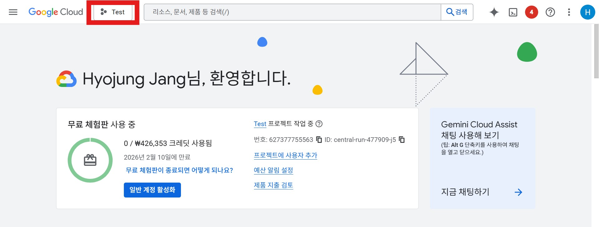

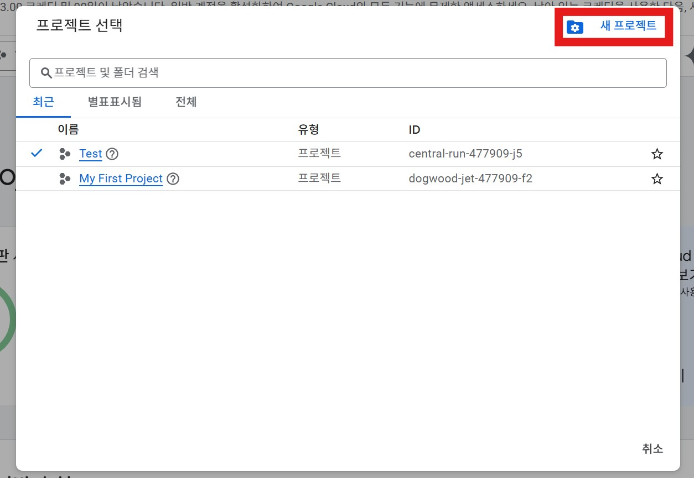

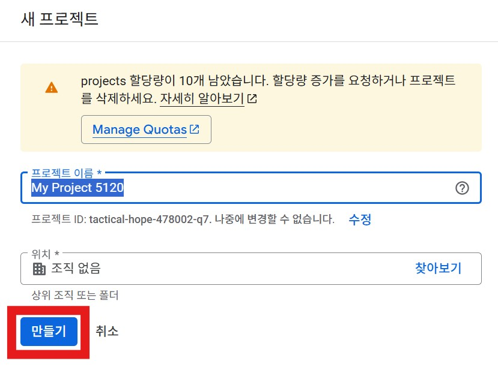

3. 인스턴스 설정

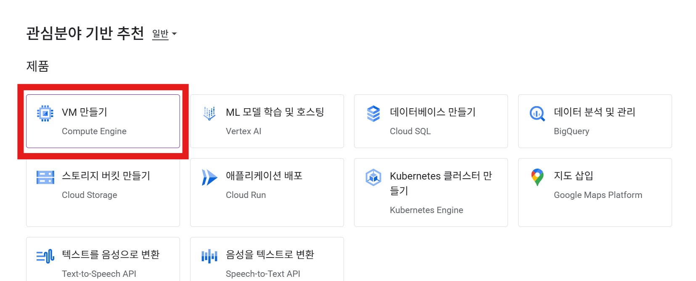

- GPU 유형

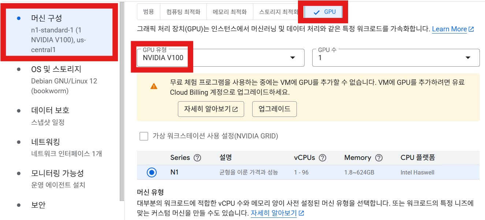

NVIDIA V100 또는 L4 추천 → 요청 승인 필요

- 머신 유형

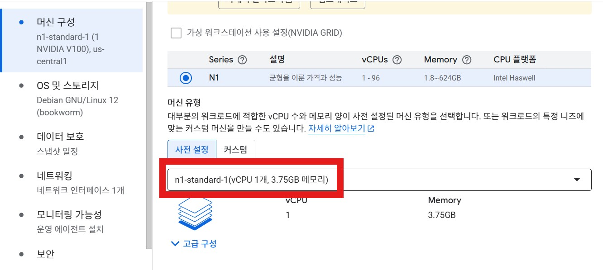

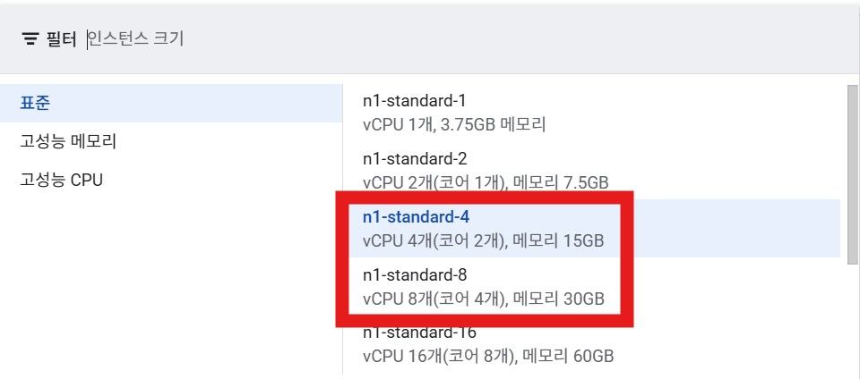

n1-standard-4 또는 n1-standard-8 추천

- 부팅 디스크

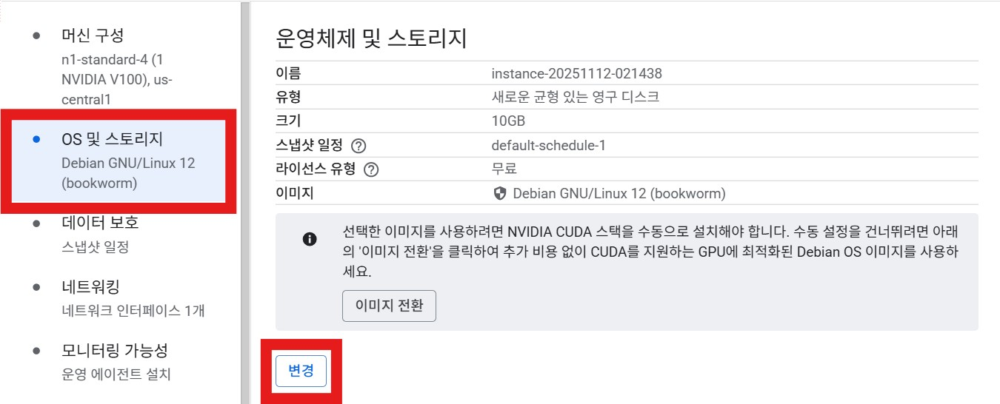


cuda가 포함된 디스크 선택

학습 데이터가 큰 경우 100GB이상 추천

- 네트워킹

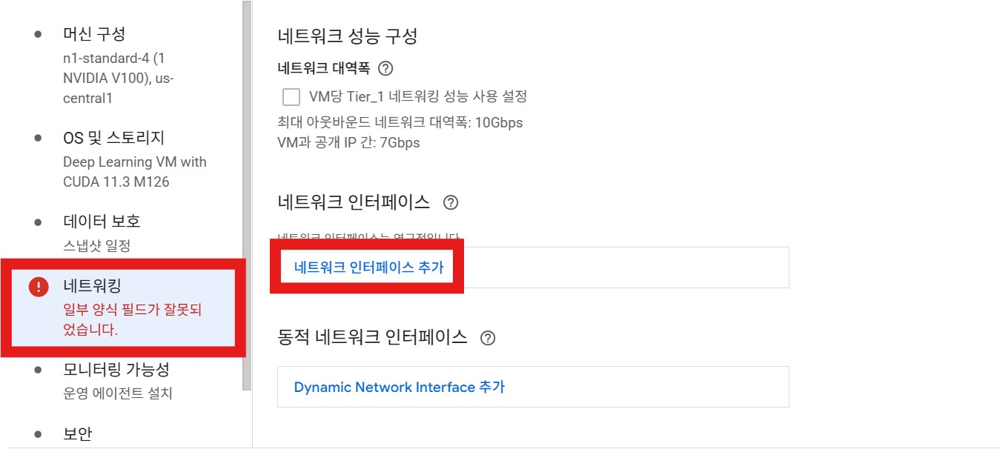

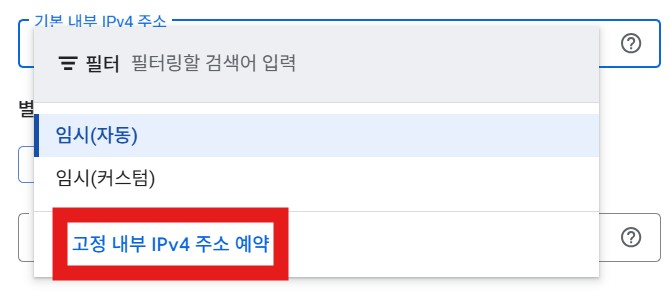

### VS Code 연결

1. SSH 연결

- VS Code에 설치

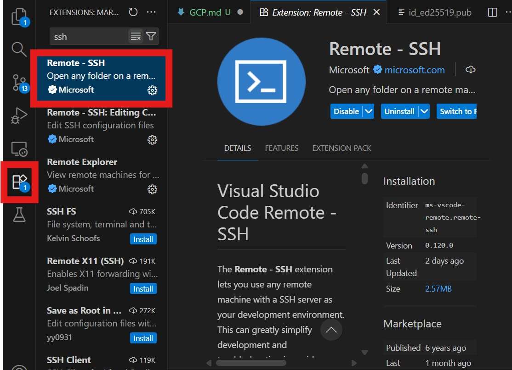

- ssh 키 생성

```python
ssh-keygen -t rsa
```

명령 프롬프트에 입력

해당 경로(예: C:\Users\사용자\.ssh 폴더) id_000, id_000.pub 파일 생성 → .pub 파일에 있는 키 복사


- GCP에 ssh 키 등록

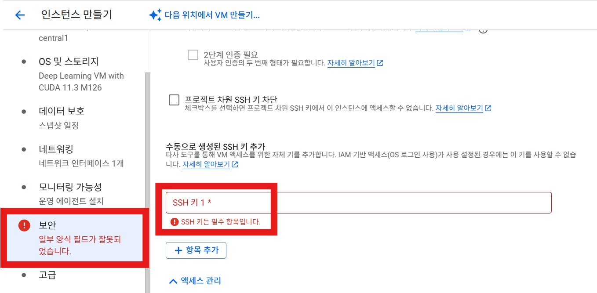

2. VS Code와 ssh 연결

vs code에서 ctrl + shift + p 누르고 Remote-SSH: Add New SSH Host... 선택


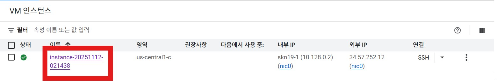

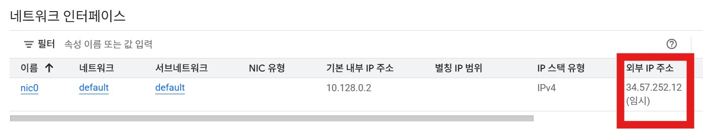

복사해서 VS Code에 붙여넣기


로컬 파일 선택


연결 확인 & 화살표 클릭하여 연결


리눅스 선택 후 continue 선택 → 시작

###### 참고: https://ariz1623.tistory.com/371, https://ariz1623.tistory.com/372