# Runpod과 VS Code 원격 연결하기

1. ssh키 생성

```python
ssh-keygen -t rsa
```

명령 프롬프트에 입력

해당 경로(예: C:\Users\사용자\.ssh 폴더) id_000, id_000.pub 파일 생성 → .pub 파일에 있는 키 복사

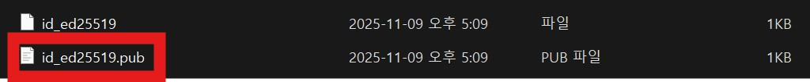

2. Runpod에서 ssh 설정

- settings에서 ssh키 입력

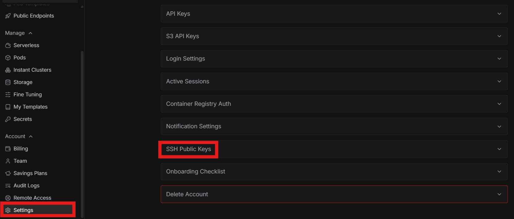

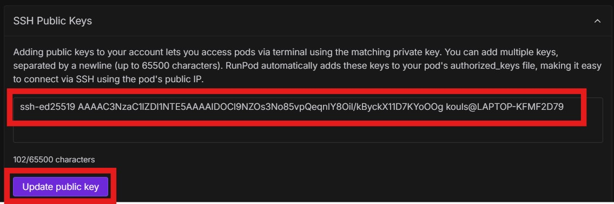

- pod 생성 시 ssh 키 활성화 확인

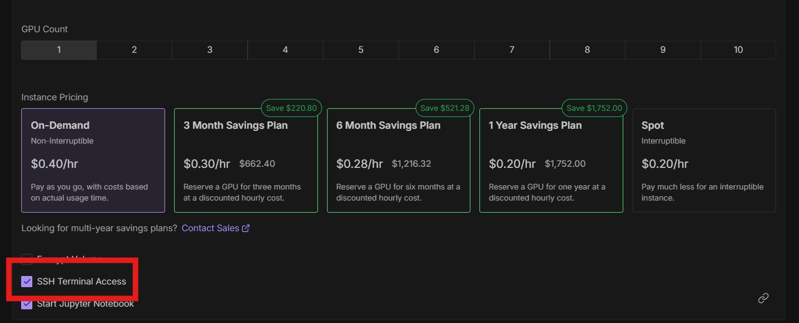

- pod 생성 후 connect에서 SSH over exposed TCP 복사

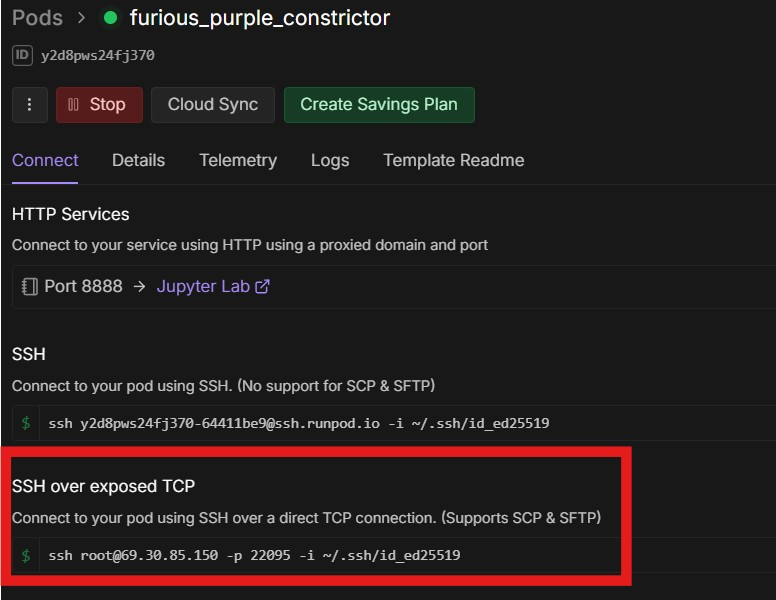

3. Runpod과 VS Code 연결

vs code에서 ctrl + shift + p 누르고 Remote-SSH: Add New SSH Host... 선택

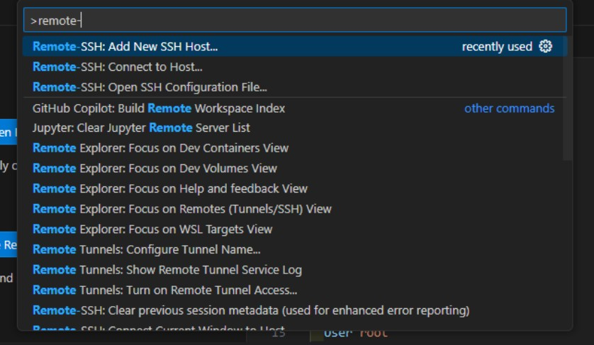

- pod의 SSH over exposed TCP 붙여넣기

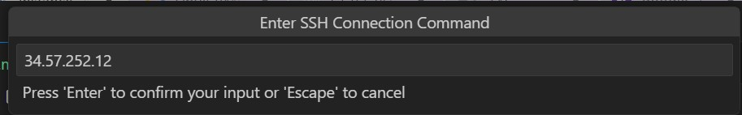

로컬 파일 선택

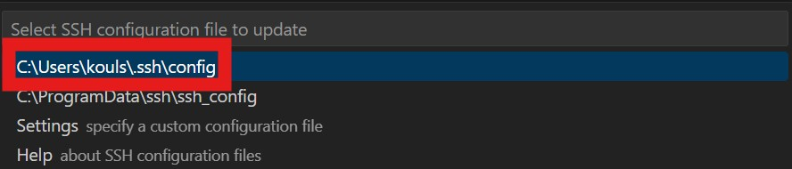

연결 확인 & 화살표 클릭하여 연결

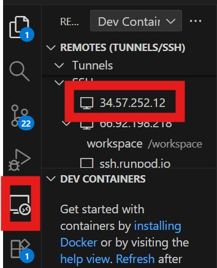

리눅스 선택 후 continue 선택 

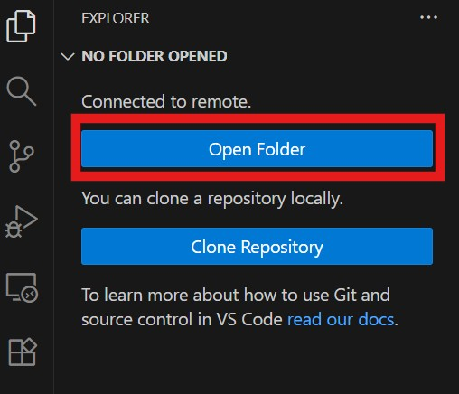

오픈 폴더 선택 후 /root 지우고 /workspace/ 입력

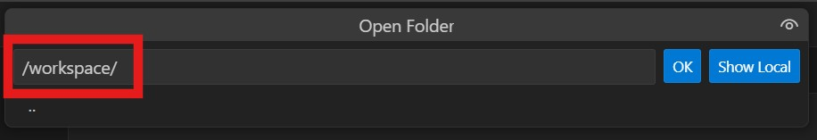

ok 선택 후 작업 시작